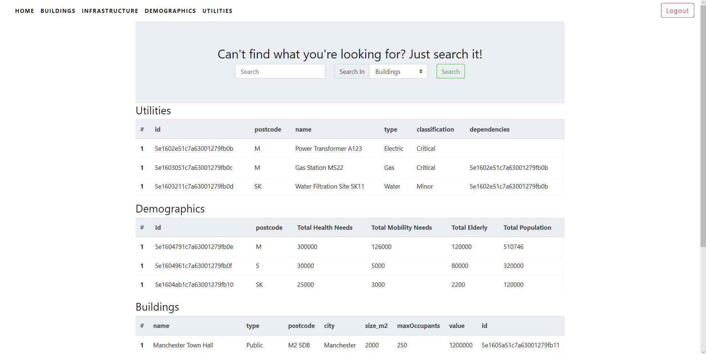

# Hack Camp 2020 - The University of Salford

The project is part of the annual HackCamp within the University of Salford. We have been working on the software for nearly 3
weeks, using Agile and Scrum Methodologies. The software was developed for a client - THINKlab (Leading Research in advanced
technology platforms). One of their current projects is Mobilise which is an interactive environment to allow decision makers,
emergency services and citizens to make informed decisions around disaster management and resilience. The Mobilise Project
develops a visualisation platform for Geospatial Information.

The client wanted the team to create an app which visualises more general data such as population information and building
types. The client's API has been used, in order to get the information needed.

**You can see screenshot of the home screen after successful login below.**



## Technologies

- Bootstrap 4
- HTML5
- CSS3
- PHP 7

## Usage 

In order to access the information, you need to create an account in the website. Then, you can log in and see all the
information listed. The login will enable a search function as well. You will be able to search for any information you need.

## Running the tests

*Required PHPUnit installed*

```bash
$ phpunit src/Models/UserFunctionsTest.php
$ phpunit src/Models/DataSetTest.php
```

## Authors

- [Georgi Orozov](https://github.com/georgi-orozov)
- [Syed Abidi](https://github.com/syedabidi110)
- [Michael Corbett](https://github.com/snorbett)
- [Hristo Zhelyazkov](https://github.com/franko-coder) 
- [Muhammad Hushmat](https://github.com/husnain11)
